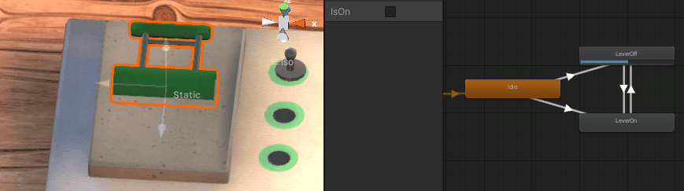

# TP Electric Panel

L'objectif de ce TP est de créer la logique de ce panneau électrique. L'utilisateur peut connecter les leviers de gauche aux LEDs de droite en passant à travers des portes logiques. Il faut que les LEDs réagissent correctement (s'éteignent/s'allument) en fonction de l'input des leviers (0 ou 1).

## 1 - Portes logiques

Les portes logiques doivent hériter d'une classe de base donnée ci dessous :

    public abstract class LogicGateBase : MonoBehaviour
	{
	    public ConnectionPin[] connectionPins;

	    public abstract bool UseGate();
	}

On paramétrera à la main les `connectionPins` en entrée via l'éditeur. Ils correspondent aux slots à gauche de la porte logique auxquels on peut connecter des fils. Certaines portes ont une seule entrée et d'autres deux. Les `connectionPins` possèdent un état 0 ou 1 accessible par leur propriété `myConnectionPin.IsOn`.
Pour chaque type de porte logique, il faut implémenter la fonction `UseGate()`, qui en fonction de la/des entrées retourne le résultat de l'opération logique.
Il y a 4 portes logiques à implémenter : **Direct**, **Not**, **And** et **Or**.

## 2 - Leviers

Les leviers sont à 0 quand ils sont vers le haut, et 1 quand ils sont vers le bas.

* Créer un *animator* permettant de passer le levier en position haute ou position basse (il peut ressembler à celui du gif ou non).
* Dans le script `Lever.cs`, changer l'état du levier lors d'un clique gauche de souris dessus. L'état du levier doit être sauvegardé dans la variable `isOn`.
*  Controller l'Animator pour que l'animation corresponde à l'état du levier (levier vers le bas si `isOn` est vraie).

## 3 - Cordes

On travaille dans le script `Rope.cs`.
Pour réaliser la physique de la corde, il faut remplir les deux fonctions `ApplyDisplacement(int i)` et `ApplyDistanceConstraint(int pointA, int pointB, float desiredSegmentLength)`.

**L'algorithme est le suivant :**
* Créer un tableau de `RopePoint` qui composeront la corde. Les points possèdent des informations sur leur position actuelle, leur position à la frame précédente et si ils sont libres (les extrémités ne le sont pas).
* Définir la longueur des segments de la corde. C'est à dire la distance voulue entre un point de la corde et chacun de ses deux voisins.
* Pour chaque point, reproduire le mouvement de la frame précédente fois un multiplicateur pour atténuer légèrement (0.3 marche bien). **Ce comportement est à implémenter dans la fonction `ApplyDisplacement(int i)`.**
* Pour chaque segment, écarter ou rapprocher les deux points qui le composent pour que la longueur du segment soit exactement celle définie à la création de la corde. On distingue trois cas :
	* Si les point A et B sont libres, alors les deux points se déplacent de manière équivalente.
	* Si le point A est fixe, alors seulement B se déplace pour contenter la longueur voulue du segment.
	* Si le point B est fixe, alors seulement A se déplace.
**Ces comportements sont à implémenter dans la fonction `ApplyDistanceConstraint(int pointA, int pointB, float desiredSegmentLength)`.**
* Répéter l'opération précédente autant de fois que désirée pour fluidifier le mouvement (nombre d'itérations de l'algorithme).

## Rendu

* **Par mail : antoine.collot@live.com**
* Rappeler les membres du groupe.
* Le code source du projet, donc un zip contenant les dossiers *"Assets"* et *"ProjectSettings"* et *"Packages"* de votre projet Unity. Par exemple avec https://wetransfer.com/ ou lien du projet sur github.
